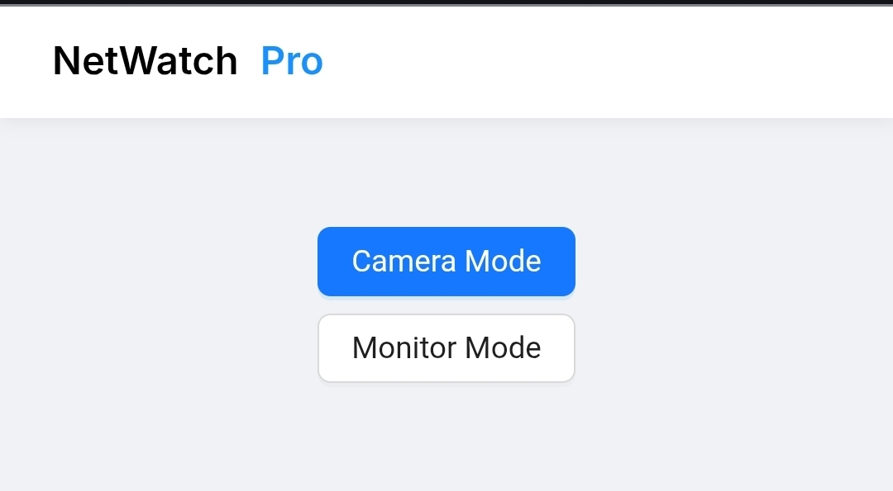

<p align="center">
  
  
  <h1>📡 NetWatch Pro</h1>
  <p><strong>Real-Time Camera Monitoring System</strong><br>Educational CCTV Architecture Simulation</p>
</p>

<p align="center">
  <a href="https://github.com/kanchanmaji/netwatch-pro/actions">
    
  </a>
  <a href="https://github.com/kanchanmaji/netwatch-pro/stargazers">
    
  </a>
  <a href="https://flask.palletsprojects.com/">
    
  </a>
  <a href="https://react.dev/">
    
  </a>
  <a href="https://socket.io/">
    
  </a>
</p>

<p align="center">
  <a href="#how-it-works">How It Works</a> ·
  <a href="#tech-stack">Tech Stack</a> ·
  <a href="#installation">Installation</a> ·
  <a href="https://kanchanmaji.in">Author Website</a> ·
  <a href="https://github.com/kanchanmaji/netwatch-pro/issues">Report Bug</a>
</p>

<p align="center">
  Built for students and developers to understand video streaming architecture.<br>
  Please consider <a href="https://github.com/kanchanmaji/netwatch-pro/stargazers">starring the project</a> if you find it useful!
</p>

## Table of Contents

- [About The Project](#about-the-project)
- [Important Notices](#important-notices)
- [Release Information](#release-information)
- [How It Works](#how-it-works)
- [Tech Stack](#tech-stack)
- [Installation](#installation)
- [Running The Application](#running-the-application)
- [Global Sharing (Cloudflare)](#global-sharing)
- [Author](#author)
- [License](#license)

---

## 🧠 About The Project

**NetWatch Pro** is a lightweight real-time camera streaming system built to understand how CCTV and IP camera systems work internally.

Instead of relying on heavy pre-built streaming protocols, this project breaks down the process of capturing frames, encoding them, and transmitting them via WebSockets.

This project simulates:

- 🎥 **Camera capture** (Browser API)
- 🔁 **Live frame transmission** (Socket.IO)
- 🖥 **Real-time monitoring** (Dashboard)
- 🔐 **Basic authentication**
- 🌍 **Global sharing** (via Cloudflare Tunnel)

## ⚠️ Important Notices

> **! IMPORTANT**  
> **Educational Use Only**: This is a prototype designed to teach streaming architecture. It is **not** a production-grade security system and does not include advanced encryption or storage capabilities found in commercial CCTV systems.

> **! NOTE**  
> **Browser Permissions**: Since this application uses \`getUserMedia()\`, your browser will request permission to access the camera. Ensure you allow this for the demo to function.

## 🚀 Release Information

| Field       | Value              | Description                  |
|-------------|--------------------|------------------------------|
| 📦 **Version**   | **v1.0.3**         | Current stable release       |
| 👨‍💻 **Owner**    | **Kanchan Maji**   | Lead Developer               |
| 🌐 **Website**   | [kanchanmaji.in](https://kanchanmaji.in) | Author Portfolio             |
| 📅 **Year**      | **2026**           | Release Year                 |
| 🎯 **Objective** | **Education**      | CCTV Architecture Study      |

## ⚙️ How It Works

The system operates on a client-server architecture using WebSockets for low-latency transmission.

1. **Capture**: Browser captures live video using \`getUserMedia()\`.
2. **Process**: Frames are drawn to a hidden \`<canvas>\` element.
3. **Encode**: Frames are converted into base64 JPEG format.
4. **Transmit**: Data is sent to the backend using \`socket.emit\`.
5. **Broadcast**: Flask receives the frame and broadcasts it to all connected monitor clients.
6. **Render**: Monitor clients update their image source (\`src\`) in real-time.

## 🛠 Tech Stack

| Component     | Technology                                                                 | Role                             |
|---------------|----------------------------------------------------------------------------|----------------------------------|
| **Backend**   |   | Server Logic & Socket Handling   |
| **Frontend**  |  | UI & Camera Component            |
| **Real-time** |  | Bidirectional Communication      |
| **Styling**   |  | UI Library                       |
| **Tunneling** |  | Exposing Localhost to Internet   |

## 📦 Installation

### 1️⃣ Clone Repository

```bash
git clone https://github.com/kanchanmaji/netwatch-pro.git
cd netwatch-pro
```

### 2️⃣ Create Virtual Environment

It is recommended to use a virtual environment to manage dependencies.

```bash
python -m venv venv
```

**Activate the environment:**

- **Linux / Mac:**
  ```bash
  source venv/bin/activate
  ```

- **Windows:**
   ```bash
  venv\\Scripts\\activate
  ```

### 3️⃣ Install Dependencies

```bash
pip install flask flask-socketio
```

> **! WARNING**  
> If you are on **Windows**, you may need to install \`eventlet\` for better WebSocket performance:

```bash
pip install eventlet
```

## ▶ Running The Application

```bash
python app.py
```

The application will typically be available at \`http://localhost:5000\`.

## 🌍 Global Sharing with Cloudflare Tunnel

To make your local CCTV stream accessible via the internet (HTTPS):

1. Install **Cloudflared**.
2. Run:

```bash
cloudflared tunnel --url http://localhost:5000
```

You will receive a unique \`trycloudflare.com\` URL to share globally.

---

## 👨‍💻 Author

<p>
  <a href="https://kanchanmaji.in">
    
  </a>
  
  **Kanchan Maji**  
  *Software Developer & Technology Explorer*
</p>

I build full-stack applications and educational tech demos.  
Check out my website for more projects.

🌐 https://kanchanmaji.in

<div style="clear: both;"></div>

## 📄 License

This project is licensed under the **MIT License** — see the [LICENSE](LICENSE) file for details.  
Open-source for educational use.

---

<p align="center">
  Made with ❤️ and Python
</p>
